#Spreadsheet

This is the showcase of a simple spreadsheet program. This program is built using HTML, CSS and C#, using Blazor.

The homepage of the app look like this: 

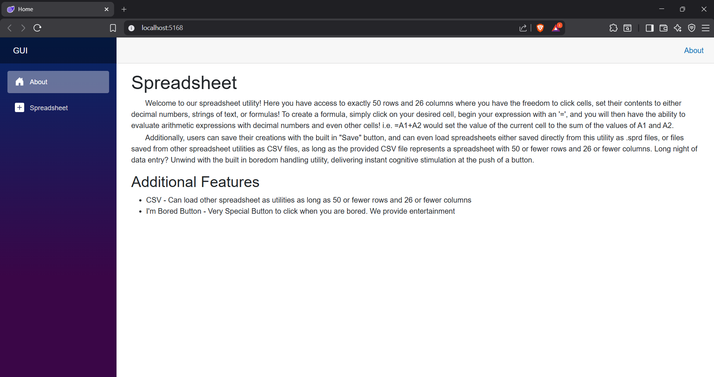

The homepage just tells the user what this app is and some basic instructions on how to use it. 

Clicking on the Spreadsheet button towards the left of the screen is where the bulk of the program is and looks like: 

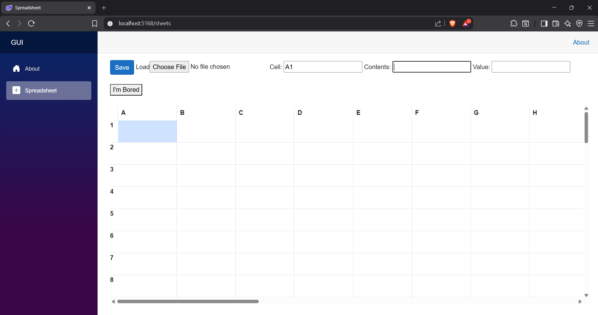

The defeault cell highlited is A1. The design of the backend is split up using the MVC design principles. The model, in this case only knows about the cell name and contents, values, and dependencies. The spreadsheet model class has something like this: 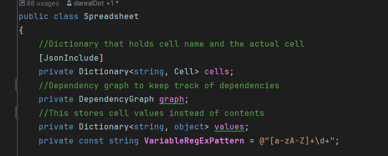

Clicking on any cell with highlight it and allow the user to fill in the contents. 

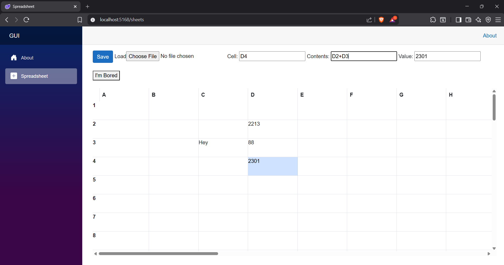

Here it is shown that the contents of the cell D4 is an addition of D2+D3. This is one reason why keeping a value and contents seperate can be helpful.

Saving the sheet lets you save the spreadsheet anywhere. It is saved as a .sprd file.  The saving makes use of JSON. The sheet above has these contents saved in the .sprd file:

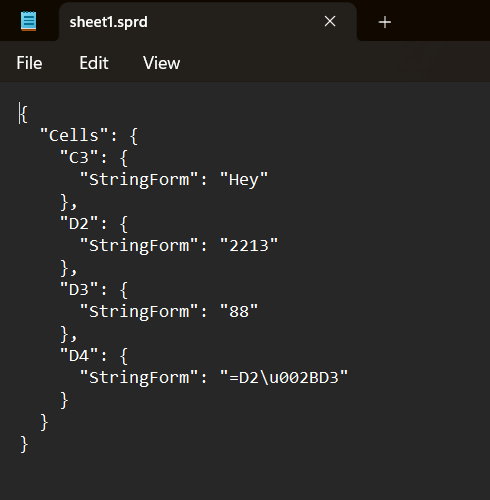

Loading a sheet like this: 

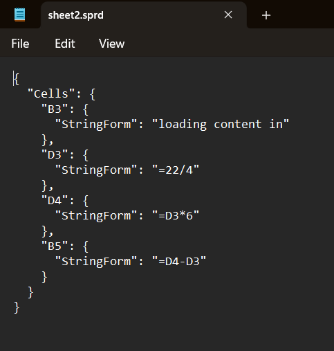

would look like this in the GUI:

loading this csv saved from Microsoft Excel:

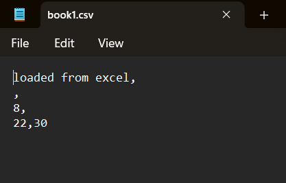

shows this into the GUI:

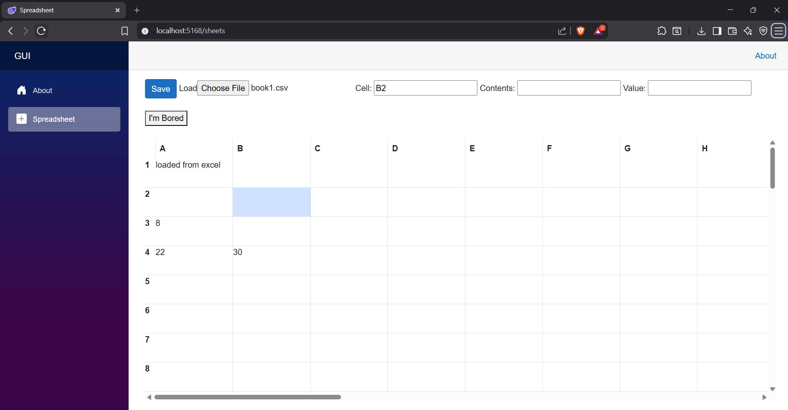

Error checking is also built into the app. Whenever the user inputs a incorrect formula like "=22/0" the app provides visual feedback on the error and reverts to the previous stage. Similar things happen when the user makes a circular dependency. Shown respectively: 

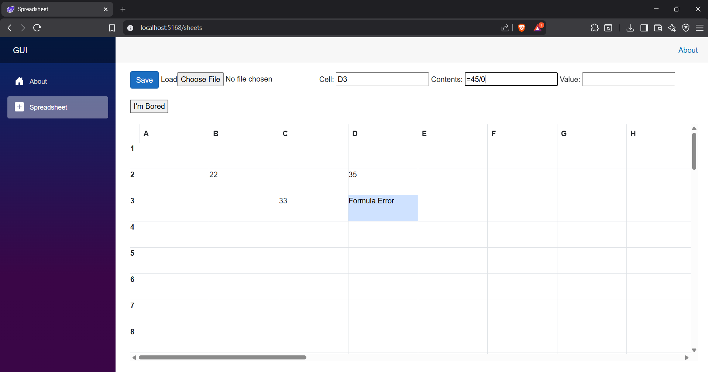

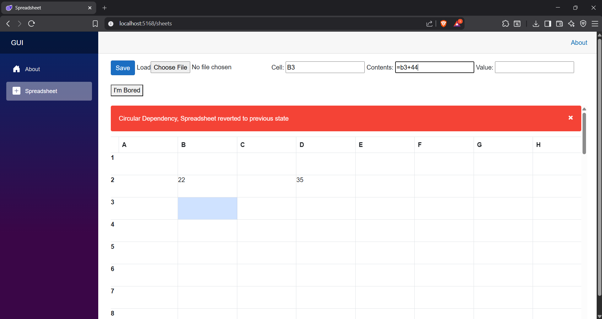

The backend uses a Formula Class to keep track of formulas entered and solving the formulas. The "Formula Error" above is from the formula class. This class ensures that a valid formula has entered before updating the spreadsheet backend. The Formula class also has an evaluate method to evaluate the formula's provided: 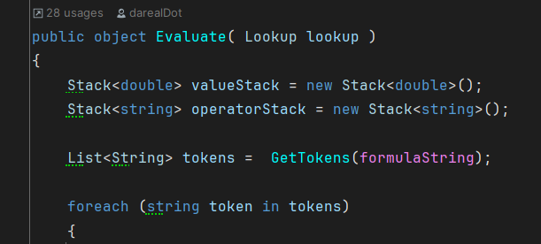

Syntax checking is also done in this class, by keeping track of the operators. 

Pressing the long awaited "I'm Bored" button plays a video from YouTube to keep the user entertained: 

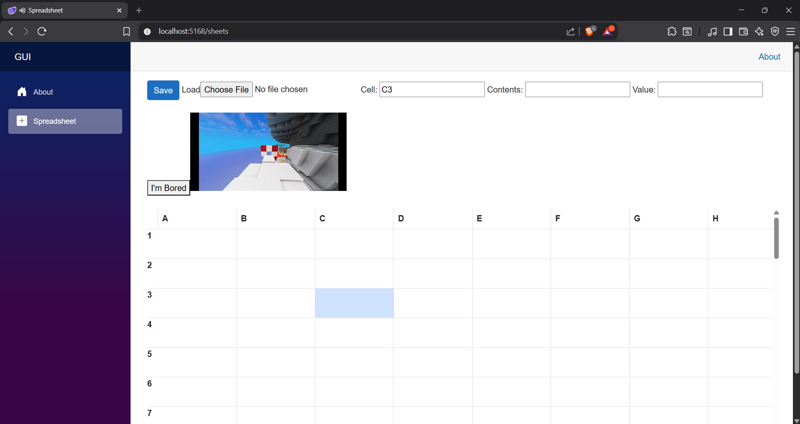
